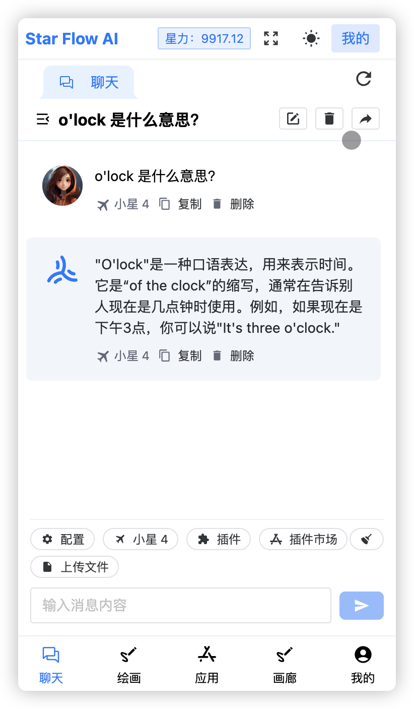

在 11 月 6 日，万众期待的 OpenAI DevDay，ChatGPT 发布了一系列新的产品，其中推出了 GPT4 Turbo，并且将GPT4 Vision，DELL·E3 等等能力全部集合到一起，不需要再分开使用，原来的局限的文本聊天也进一步走向多模态，并且还重点推出了 GPTs，你可以自由地定制自己的专属 GPT。

虽然 ChatGPT 已经 🔥 了快一年，但是目前看还有很多人使用受阻，StarFlow 以提高生产力和降低使用门槛为目标，**提供优质、易于访问、高性价比的 AI 服务**，当然，StarFlow 也同步跟进了最新的 GPT 产品更新。

👉 体验 StarFlow 的全新服务，请访问：https://www.starflow.tech/chat

  

选择问题，即可直接开聊：

  

目前支持多个模型，模型能力可以点击模型详情查看：

其中「小星 4 全能版」火力全开，不仅提供文本聊天，还可以处理图片文件，并且针对**图片内容进行深度问答**，解锁更广阔的交互维度，比如我发送一张包含笑话的图片：

  

> ✨ 目前 GPT4 Vision 图片功能对于回答图片内容非常强，但目前还存在一些局限，比如汉字识别比较差，还比如传入多张图片的话，没办法识别顺序。

你也可以直接让它**生成图片**，它会调用 DELL·E3 模型生成图片：

  

你可以选择 GPTs，目前 StarFlow 已经同步官方 3000+ 的 GPT，比如这款「 Logo 制作器」，**简单的一句话**，就可以帮助你绘制一个专业的 Logo：

  

如果效果不尽人意，可以继续引导重新生成：

  

以上就是 StarFlow 的新版能力，当然，更多的新能力也在持续跟进中 🏃‍♀️。StarFlow 坚持**长期主义**，通过提供优质的 AI 基础服务，以及合理的价格，可以让国内用户体验到最新最全的大模型能力，**解决问题、提高效率，专注自己的核心价值**。

