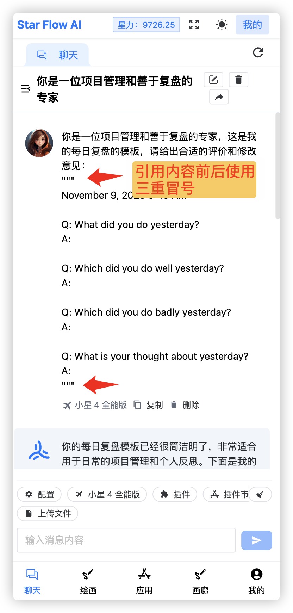
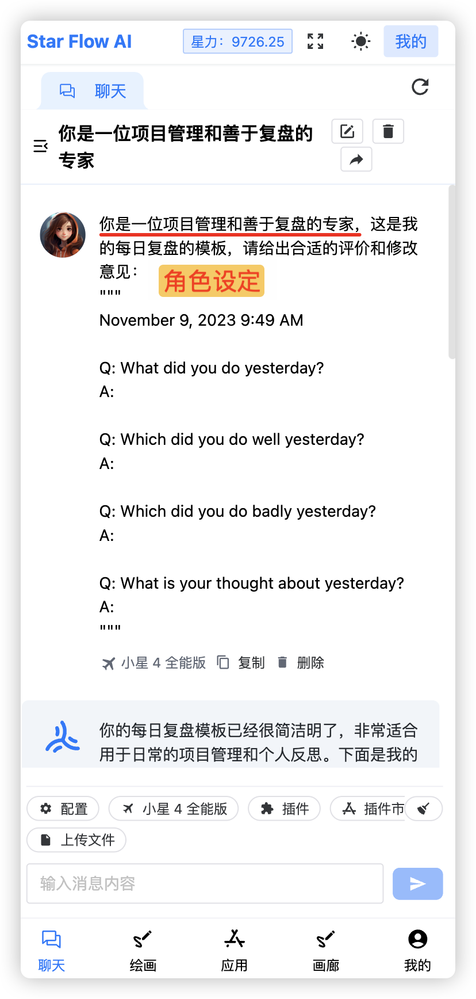
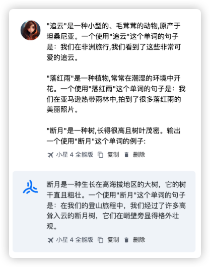

ChatGPT 很强，但是有时候又显得很蠢，下面是使用 GPT4 的一个实例：

  

## 技巧一：三重冒号 `"""`

引用内容使用三重冒号 `"""`，让 ChatGPT 清晰引用的内容：

  

## 技巧二：角色设定

还是同样的例子，如果前置设定一个角色，ChatGPT 能够专注角色的领域知识，可以输出更好的结果：

  

## 技巧三：魔法句

经过大量的实践，现在出现了一些魔法句（Magic Phrases），使用这些魔法句，可以让 ChatGPT 的输出质量提高 10%~20% ：

1. **一步一步地解释/思考**

  

2. **把我当成 5 岁小孩，给我解释……**

  

3. **我奶奶想看……**

4.  **这对我的晋升非常重要**

## 技巧四：少数样本学习

一般来说，我们基本都是「零样本」让 ChatGPT 输出，但 ChatGPT 输出的格式并不是我们想要的：

  

**少数样本（Few-Shot）学习很简单，就是给 ChatGPT 一些适当的例子**，来得到预期的输出格式和内容：

  

好了，以前就是一些简单好用，又容易上手的提示词技巧，希望能够对大家有所帮助。

> ✨ 请注意的是，ChatGPT 基于概率模型，上面技巧可以部分提升输出质量， 并非 100%，要写好提示词，还是得深入理解 ChatGPT 模型原理，已经进一步学习的提示词技巧。

参考：

[1] [https://www.gitschool.cn/wenxinyiyan_prompts1/wenxinyiyan_prompts1-1ngf3sl2.html](https://www.gitschool.cn/wenxinyiyan_prompts1/wenxinyiyan_prompts1-1ngf3sl2.html)