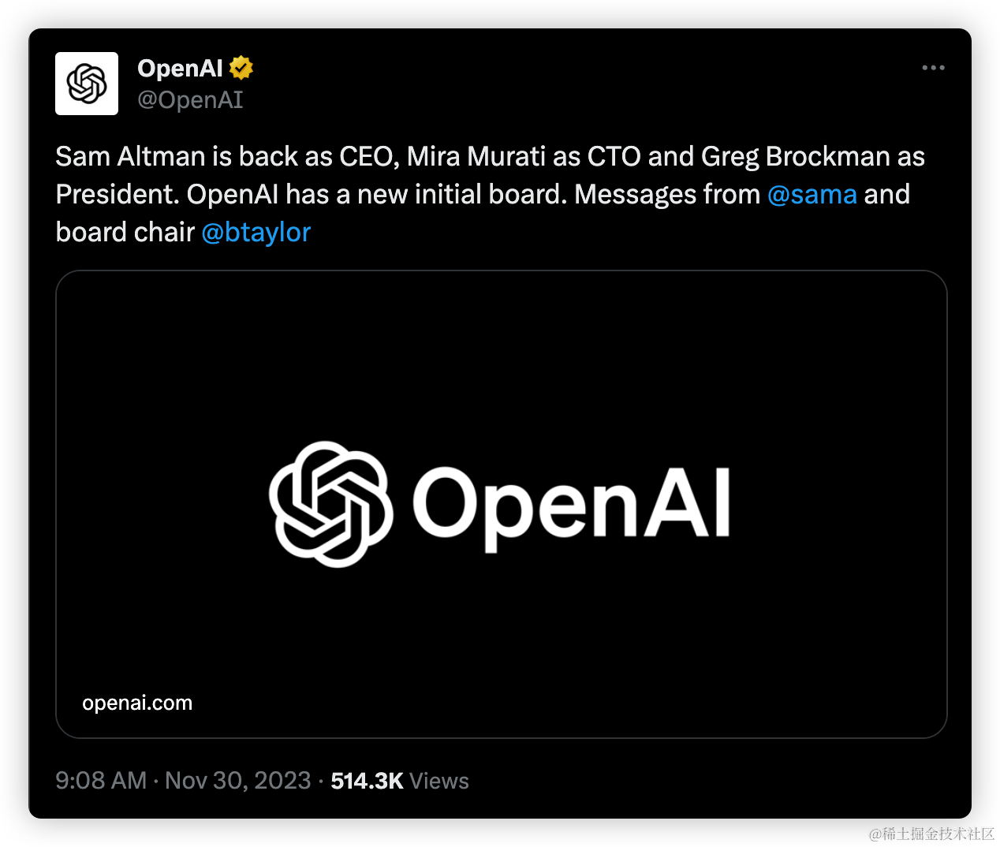
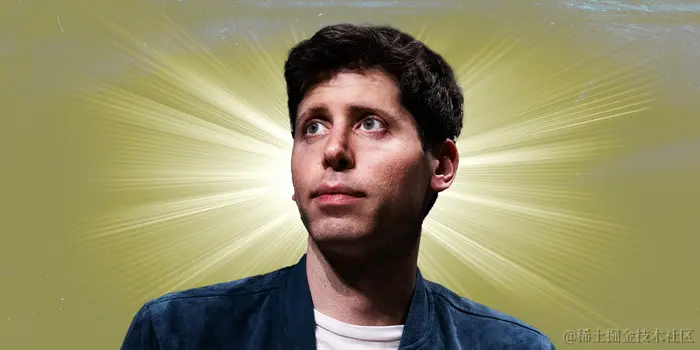

今天，OpenAI **正式宣布**山姆·奥特曼回归 OpenAI，**重新担任 CEO**：

  

米拉将回归首席技术官职位（CTO）而新的初步董事会成员包括布雷特·泰勒（主席）、拉里·萨默斯和亚当·D'安杰洛。经此一役，可以确定的是，**山姆·奥特曼将奠定他在 OpenAI 的绝对地位。**

  

以下是山姆·奥特曼的致 OpenAI 的公开信：

> 大家好，
> 
>
> **我回归担任 OpenAI 的 CEO。米拉将回到她的 CTO 角色。新的初始董事会将由 Bret Taylor（主席）、Larry Summers 和 Adam D’Angelo 组成。**  
>
> 我对未来的激动之情前所未有。感谢大家在这样一个不确定和前所未有的情况下的辛勤工作，我相信我们的韧性和精神在业内是独一无二的。对于实现我们的使命，我对我们的成功几率感到非常、非常好。
>   
>  
> 在讨论接下来的事情之前，我想表达一些感谢。
>   
>  
> 我爱并尊重 Ilya，我认为他是这个领域的指路明灯，是个宝贵的人。我对他没有任何恶意。**虽然 Ilya 将不再担任董事会成员，但我们希望继续我们的工作关系，并在讨论他如何继续在 OpenAI 的工作。**
>   
>
> 我感谢 Adam、Tasha 和 Helen 与我们一起找到最符合使命的解决方案。我很高兴能继续与 Adam 合作，并真诚地感谢 Helen 和 Tasha 在这个过程中投入的巨大努力。
>   
>  
> **也感谢 Emmett，在帮助我们达成这个结果方面发挥了关键和建设性的作用**。Emmett 对 AI 安全和平衡利益相关者的兴趣是显而易见的。
>   
>  
> 米拉在整个过程中做得非常出色，无私地为使命、团队和公司服务。她是一个了不起的领导者，没有她就没有 OpenAI。谢谢你。
>   
>  
> **我和 Greg 是经营这家公司的伙伴**。我们从未真正弄清楚如何在组织结构图上表达这一点，但我们会的。同时，我只是想澄清这一点。感谢你从一开始就做的一切，以及从这一切开始的那一刻起以及过去一周里你所做的一切。
>   
>  
> 领导团队——Mira、Brad、Jason、Che、Hannah、Diane、Anna、Bob、Srinivas、Matt、Lilian、Miles、Jan、Wojciech、John、Jonathan、Pat 等等——显然已经准备好在没有我的情况下运营公司。他们说评价一个 CEO 的一种方式是你如何挑选和培养潜在的继任者；在这个指标上，我做得比我意识到的要好得多。**我清楚地看到公司掌握在优秀的人手中**，我希望这一点对每个人都是显而易见的。感谢大家。
>   
>  
> Jakub、Szymon 和 Aleksander 是杰出的人才，我很高兴他们重返公司推动我们和我们的研究向前发展。谢谢。
>   
>  
> 对于你们所有人，我们的团队：我相信关于这段时期将会有书籍被写出来，我希望它们首先提到的是整个团队是多么的了不起。现在我们已经度过了这一切，**我们没有失去一个员工**。你们坚定地为彼此、这家公司和我们的使命站在一起。构建安全 AGI 的团队最重要的事情之一是能够处理紧张和不确定的情况，并始终保持良好的判断力。满分。感谢大家。
>   
>  
> Satya、Kevin、Amy 和 Brad 在整个过程中都是令人难以置信的合作伙伴，他们的优先事项始终正确。他们支持我们的背后，并准备好欢迎我们所有人，如果我们不能实现我们的主要目标。**我们明确做出了与 Microsoft 合作的正确选择，我很高兴我们的新董事会将包括他们作为非投票观察员**。谢谢。
>   
>  
> 对于我们的合作伙伴和用户，感谢你们与我们同在。我们真切地感受到了支持和爱，这帮助我们所有人度过了这段时期。我们**没有失去一个客户**的事实将驱使我们更加努力地为你们工作，我们都很高兴能回到工作岗位。
>   
>  
> Will Hurd、Brian Chesky、Bret Taylor 和 Larry Summers 暂停了他们的生活，为支持使命付出了巨大的努力。我不知道他们是如何做得如此出色，但他们确实做到了。谢谢。
>   
>  
> Ollie 也在整个时间里暂停了他的生活，只是尽一切所能帮助，此外还提供了他通常的无条件爱和支持。谢谢，我爱你。
>
>   
> 那么接下来是什么？
>
>   
>  
> 我们有**三个紧迫的优先事项**。
>   
>  
> **推进我们的研究计划**，并进一步投资于我们的全栈安全工作，这一直是我们工作的关键。我们的研究路线图很清晰；这是一个令人振奋的聚焦时刻。我分享你们所有人的兴奋；我们会将这场危机转化为机遇！我会和米拉一起努力。
>   
>  
> **继续改进和部署我们的产**品，服务我们的客户。让人们体验到 AI 的好处和承诺，并有机会塑造它，这很重要。我们继续相信，优秀的产品是实现这一目标的最佳方式。我会与 Brad、Jason 和 Anna 合作，确保我们对用户、客户、合作伙伴和全球政府的坚定承诺是明确的。
>   
>  
> Bret、Larry 和 Adam 将在**构建具有多元视角的董事会**、改进我们的治理结构并监督对近期事件的独立审查方面投入大量努力。我期待着与他们密切合作，采取这些关键步骤，以便每个人都能对 OpenAI 的稳定性充满信心。
>   
>
> 我非常期待与你们所有人一起完成构建有益 AGI 的工作——世界上最好的团队，世界上最好的使命。 
>  
> 
> 爱你们的，
> 
> 山姆
