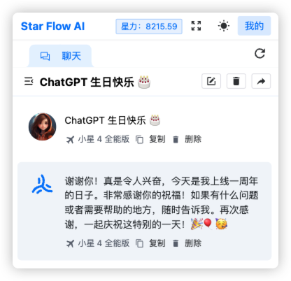

一年前，ChatGPT 正式上线，这无疑是个革命性的时刻，仅仅 6 周，ChatGPT 用户量达到 1 个亿。

  

这一年元宇宙作为概念垃圾彻底进入下水道，**而 ChatGPT 和 AI 则席卷全球**。

仅仅这一年，依托于 ChatGPT，就有无数的想法和应用诞生，但是总体来说，**AI 行业的发展还处于初期阶段**，大量应用依旧以传统聊天形式为主，一些图片、视频生成应用还在萌芽中，通用型杀手锏应用还没诞生。

但人们总是高估短期、低估长期，再过几年，相信随着对 AI 的深入了解和融合，未来世界的形态将会逐渐发生转变。**未来会是怎么样的，期待一下** ✨

下面附网友整理这一年来 OpenAI 在 ChatGPT 以及其他产品成果列表：

| 类别 | 详情 |
|---|:---|
| AI 模型与研究 | 1. 语言模型：**GPT 模型的持续进步**，提高了自然语言理解、生成和整体性能。 2. 视觉模型：视觉相关模型的发展，增强了**图像识别和生成能力**。 3. AI 安全与伦理：研究和出版物涉及 AI 技术周围的伦理含义和安全问题。 |
| 应用和工具 | 1. ChatGPT：ChatGPT 的增强版本，提供更准确和更有上下文意识的对话能力。 2. DALL-E：对 DALL-E 的升级，一个能够根据文本**描述创建图像**的 AI 程序，准确性和创造性得到改进。 3. Codex：Codex 的改进，一个旨在**理解和生成编程代码**的 AI 系统，帮助软件开发。 |
| 合作与伙伴关系 | 1. 学术合作：与大学和研究机构合作，推进 AI 研究。 2. 行业合作：与各行各业建立合作伙伴关系，将 AI 解决方案整合到现实世界的应用中。 |
| 教育计划 | 1. **在线课程和资源**：提供教育资源和课程，以促进 AI 素养和理解。  2. 研讨会和会议：主持和参与研讨会和会议，传播 AI 知识并促进社区参与。 |
| 政策和宣传 | 1. AI 政策发展：为负责任使用 AI 贡献政策和指南的制定。  2. 公众意识活动：旨在提高公众对 AI 技术及其影响的认识和理解的计划。 |
| 社区参与 | 1. 开源贡献：向开源社区发布工具和研究发现，以促进广泛使用和发展。  2. 用户反馈整合：积极将用户反馈整合到 AI 模型和应用的开发中。 |