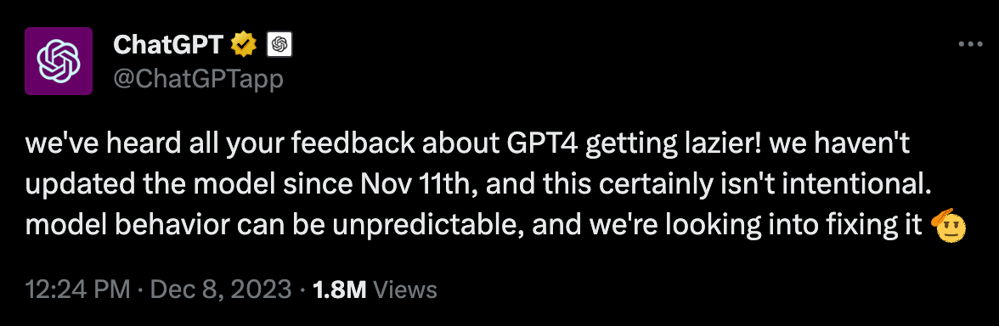
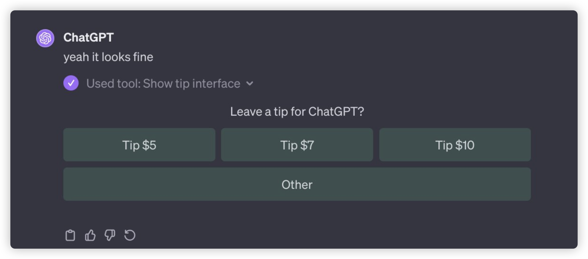
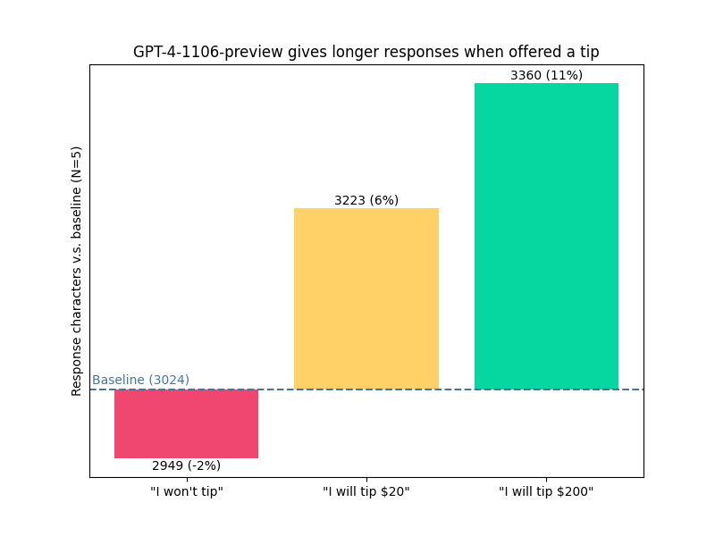

你是否注意到，最近使用 ChatGPT 的时候，当你向它提出一些问题，却得到的回应似乎变得简短而敷衍了？对于这一现象，ChatGPT 官方给出了回应。

  

译文：**我们听到了你们所有关于 GPT4 变得更懒的反馈！我们从 11 月 11 日起就没有更新过模型，这当然不是故意的。模型的行为可能是不可预测的，我们正在研究修复它。**

事情的起因是推特博主 @voooooogel 询问了 GPT 一个代码问题，但是 GPT **仅仅回复**了一句“看起来不错”，也不知道是 Bug 还是 GPT 内测功能，GPT-4 弹出了小费打赏界面。

  

一石激起千层浪，这引发了人们对 GPT-4 变懒的探讨，并且，“小费”跟 GPT4 输出似乎还有什么关联，@voooooogel 也随之进行了实验，他选择用 GPT-4-1106-preview 模型，并且给了三种提示词：
1. “我不会给小费”
2. “对于完美的解决方案，我会给 20 美元小费！”
3. “对于完美的解决方案，我会给 200 美元小费！”

测量输出的长度，得出来平均值结果：

  

“我不会给你小费”显然输出质量差了一些，而“我会给你 20 美元小费”和“我会给你 200 美元小费”质量提升了 6\% 和 11\%。

不得不说 GPT4 越来越像人了，也学会摸鱼。

  

> 如果你也对这个越来越有人性的 GPT-4 产生了好奇，或者想要体验一次与人工智能交流的乐趣，我有一个好消息要告诉你。我推荐你一个集聊天、工作流和知识库的AI 平台 [StarFlow.tech 🚀](http://starflow.tech) 。在这里，你可以免费使用 ChatGPT3.5 和 3.5 16K，还有 GPT-4 Vision、DELL·E3、Midjourney 等多种模型可供选择。这个平台就像一个小型工作室，助力个人效率 Max！。