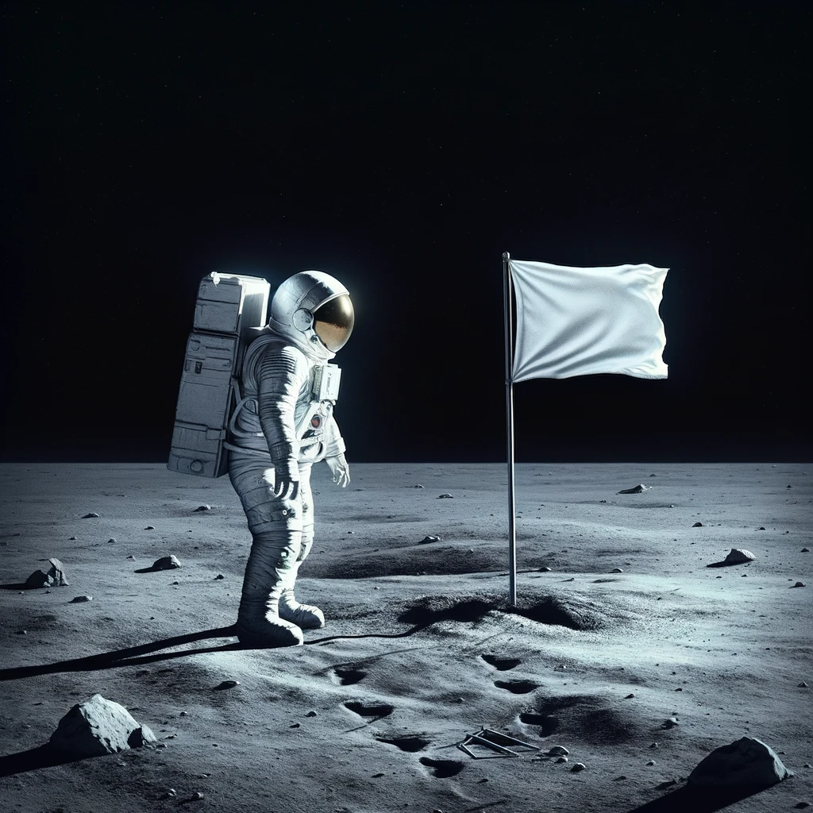
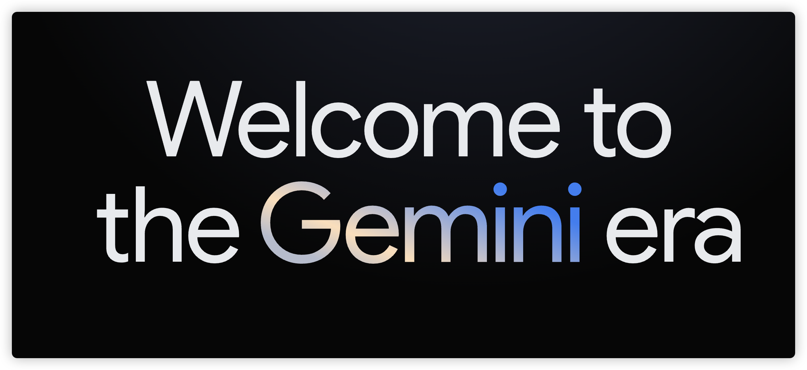
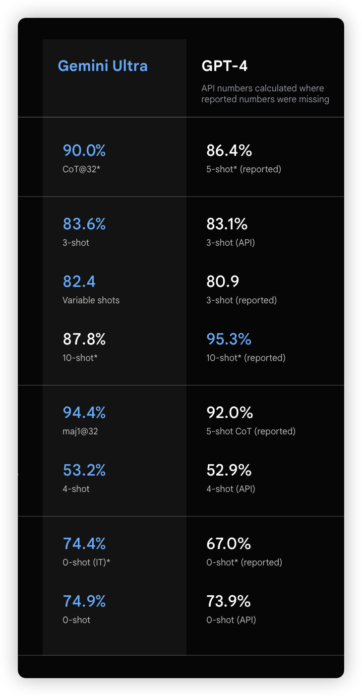
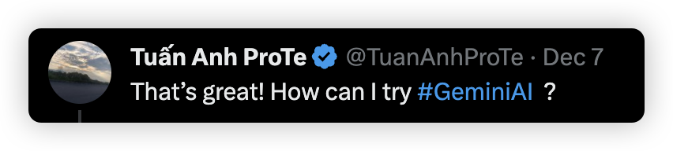
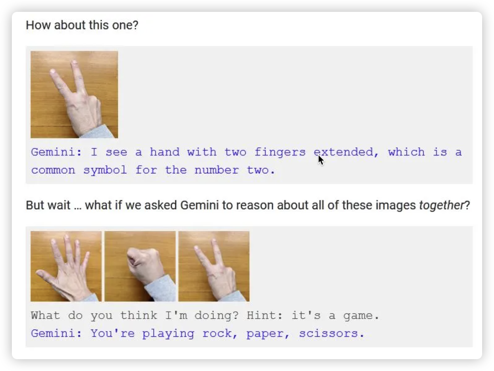
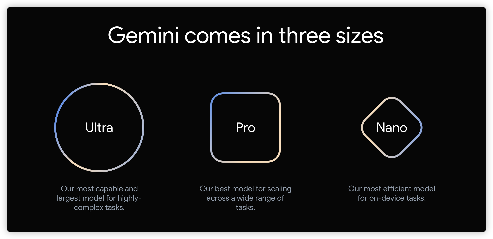

> **没有人会记住第二个登上月球的人，除了他自己。**
>
>   

谷歌现在处于尴尬的地位，在 2022 年之前，他以 Chrome + Google 搜索确立搜索领域绝对霸主之位，**全球市场份额高达 90% 之多**，FireFox、Opera 等等浏览器都难以匹敌。而随着 ChatGPT 横空出世，让这位搜索引擎巨头开始晃动。

ChatGPT 的面世， 不亚于一场工业革命，为整个社会带来了方方面面的变革，就搜索领域而言，它让搜索的形态开始发生转变，原来从**匹配条目搜索，转换为了以词为单位的搜索**。

信息的搜索，不再需要费劲构造搜索关键词，然后再一堆琳琅满目的搜索词条中一条一条费力地查抄答案。而借助 ChatGPT，你能够得到精确的答案，并且，你还能基于前一轮的问答继续询问，这种全新的信息搜集交互更智能、更高效、更深入、更具有粘性，**这打了谷歌一个措手不及**。

这股 AI 浪潮，谷歌当然不会坐以待毙，12 月 7 日，谷歌正式发布了 Gemini。

  

一系列测试证实 Gemini 遥遥领先：

  

并且还有一只 6 分半钟的演示视频，让人直呼牛逼，它展示了 Gemini  超强的多模态能力：

[video(video-oF0KYT3q-1702089103541)(type-csdn)(url-https://live.csdn.net/v/embed/350209)(image-https://live-file.csdnimg.cn/release/live/file/1702088516230.png?x-oss-process=image/resize,l_300)(title-谷歌大模型 Gemini 交互演示视频)]

看完视频，评论区也是听取 Wow 声一片：

  

  

  

但是随即，视频很快被打脸，比如猜拳，是通过发送静态图片和提示语，引导 Gemini 去说出答案：

  

这跟 GPT4 进行图片交互没什么两样，面对不绝于耳的造假之声，谷歌随后也澄清，内容全部都是真实的，**只不过为了“简洁”，将问题视频化+回答录音，然后剪辑而成**。

回看 Gemini 的三款产品，Gemini Nano，运行在手机等移动设备上，现在在 Google  Pixel 8 Prox 可以用了，Gemini Pro 版本可用，但能力约等于 ChatGPT3.5，最强版本的 Gemini Ultra，**没有任何可用的地方，但是演示视频和跑分，全都是用的这个版本**。

  

也就是，谷歌左手拿着一个 **PPT 产品**和右手拿着“简洁”的**演示视频**，号称吊打 GPT-4。

**一切都有迹可循**，今年 3 月份谷歌匆匆发布 Bard，号称能够对抗 ChatGPT，但 Bard 一经发布，漏洞百出、事实错误，一下就端掉了谷歌 1000 亿的市值。

如今的 Gemini，又是谷歌着急的表现，它太在意自己在人工智能领域上的领军地位，太在意市场份额，**太在意谷歌的利益而不是用户的利益**。

一位为谷歌工作 18 年的员工选择离开谷歌，他享受并热爱的早期的谷歌文化，但他却对如今的谷歌文化深恶痛绝，“今天谷歌的许多问题都**源于桑达尔・皮查伊**缺乏远见卓识的领导力。还源于他不愿维护早期的谷歌文化规范。这导致无能的中层管理人员越来越多”

  

> 桑达尔・皮查伊（Sundar Pichai)，自 2015 年起担任谷歌首席执行官

当然，这位离职员工还是留下希望，“不过，**我认为留给谷歌变革的时间不多了。谷歌文化的恶化最终将不可逆转**。因为能起到模范带头作用的人，正是那些愿意打破常规的人。”

最后，回顾一下曾经如日中天的雅虎的一段有趣的发展历程：

- 1998 年，雅虎**拒绝花 1 百万收购谷歌**
- 2002 年，雅虎意识错误并尝试花 30 亿收购谷歌，而谷歌开价 50 亿，雅虎**再一次拒绝**
- 2008 年，雅虎**拒绝以 40 亿卖给微软**
- 2016 年，雅虎以 **4.6 亿卖**给了 Verizon，Verizon 相当于中国的移动电信

罗马不是一日建成的，但也不是一天内倒塌的。

> 推荐一个集聊天、工作流和知识库的AI 平台 [StarFlow.tech 🚀](http://starflow.tech) 。在这里，你可以免费使用 ChatGPT3.5 和 3.5 16K，还有 GPT-4 Vision、DELL·E3、Midjourney 等多种模型可供选择。这个平台就像一个小型工作室，助力个人效率 Max！。

Reference
- https://mp.weixin.qq.com/s/83tIh_95Kx-_R6t3YlGHrw
- https://deepmind.google/technologies/gemini/#hands-on
- https://36kr.com/p/2533161257805316