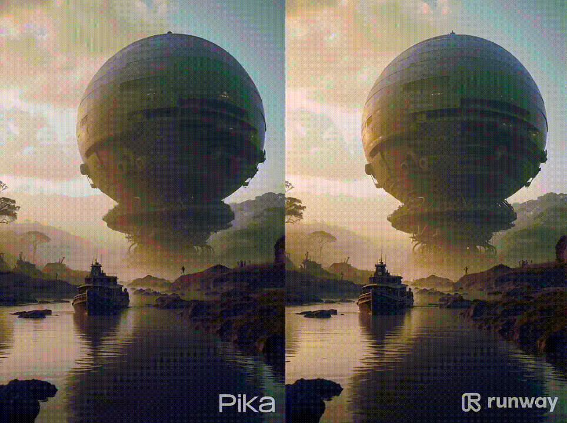
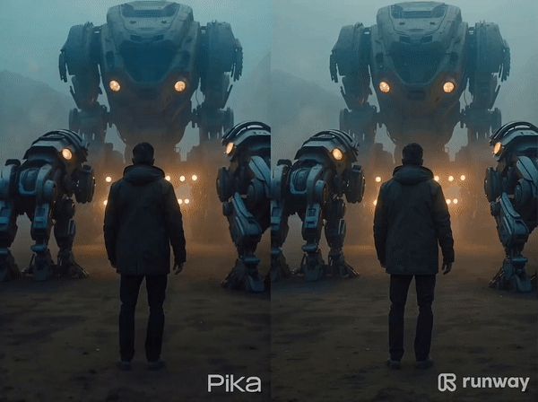
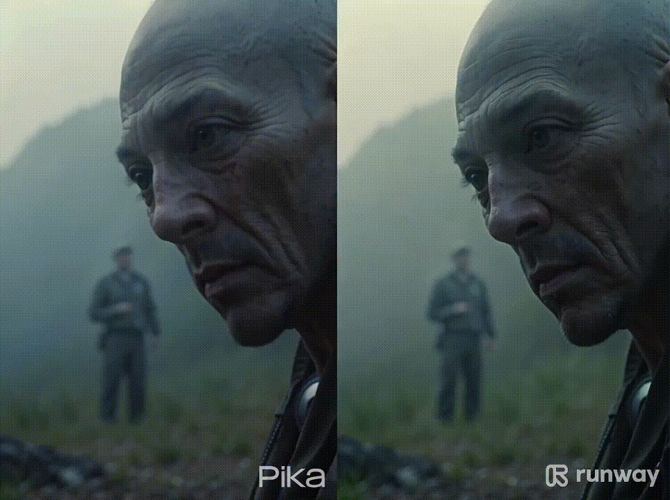

用 AI 来生成视频，**以及是一件最没有想象力的事情**，但看了两家后起之秀的 AI 视频生成厂家，Pika 和 Runway，还是小小被**震撼一下**，视频效果确实够打，来看看对比：

这里来自推友 @maxescu 制作的 Pika 和 runway 效果对比，对比规则如下：

1️⃣ 使用 235 张照片喂给 Pika 和 runway（图片生成视频）

2️⃣ 默认设置，不做任何额外调整

3️⃣ 每张图片生成 3 次，选择最好的那一次生成效果

效果对比来看：
- Runway：画面更加清晰，动态范围也得到了提升，火、烟和水的表现也更好了。
- Pika：角色动画中的布料和头发物理效果更加流畅，尽管偶尔会有些不稳定。

Pika 和 Runway 确实用 AI 把视频生成拔高了一个维度，虽然视频质量离工业级别还稍有差距，但是从成本方面来说对，一个人，一台破电脑，**只需要不到几个小时的时间，就能够制作出几分钟的剧情视频**，效果还不错，属实是降维打击。

或许在 AI 时代，我们的脚程远远比不上 AI 的这俩汽车，但是，我们不是跟它比速度，而是**拿着钥匙，学会驾驶它**。

> 推荐一个集聊天、工作流和知识库的AI 平台 [StarFlow.tech 🚀](http://starflow.tech) 。在这里，你可以免费使用 ChatGPT3.5 和 3.5 16K，还有 GPT-4 Vision、DELL·E3、Midjourney 等多种模型可供选择。这个平台就像一个小型工作室，助力个人效率 Max！。