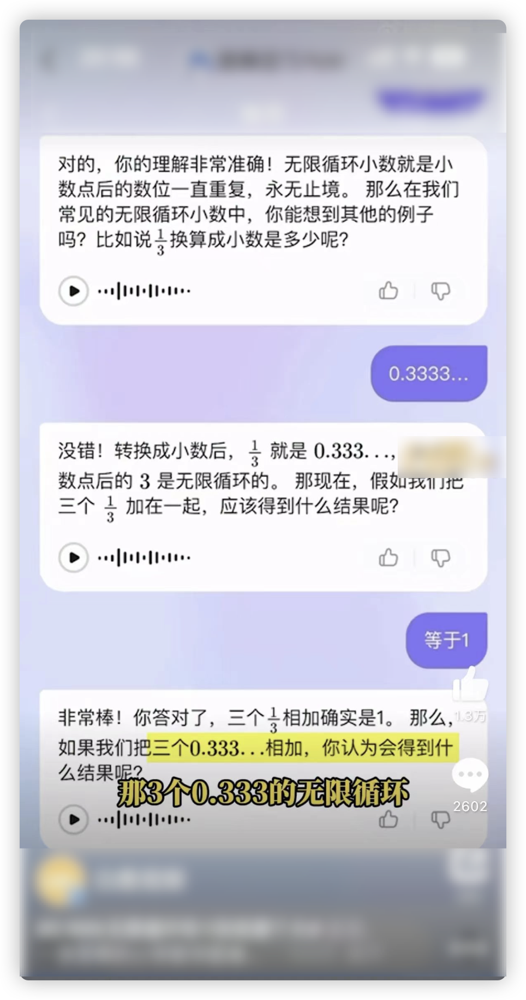
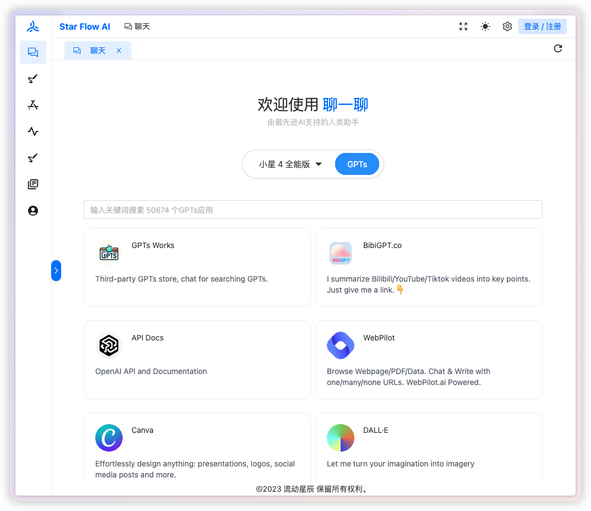

最近发现比尔盖茨还在写文章，确实了不起，68 岁的老人家还在**坚持输出**，除了写文章，比尔盖茨还致力于教育、医疗和卫生等慈善工作，奋斗在一线，看来美国人也延迟退休啊 😅

原文[《AI 将彻底改变计算机的使用方式》](https://www.gatesnotes.com/AI-agents) 大约一万多字，**从宏观的角度讲述了 AI 的形态，并且提及了 AI 将影响的四个行业，最后再讲到目前面临的技术问题和非技术问题**，整体文章深入浅出，非常值得一读。

本文做了一些删减，并尝试用自己的话去解读，更加符合中文读者的语义，其中的一些观点仅供参考，大家自由评判之，毕竟比尔先生还预测过计算机只需要 768kb 内存足以，而现在 8 个 G 都不够下饭的。

## 未来是智能体

首先比尔先生回忆了和保罗·艾伦一起创立微软公司的感觉，然后语重心长讲到，虽然经过了几十年的更迭，但是计**算机还是比较蠢笨的**，你要完成一个任务，得先选择某一个 app，比如用微软的 Word，去画一个商业的草图，但是这个 app 不能帮你发送邮件、分享自拍、分析数据、计划一个聚会，或者买电影票，要完成上述这些事情，要么找一个亲密的朋友，要么有一个个人助理。

胆大的预测，在下一个五年，AI 将彻底重构，你不需要再用为了处理不同任务，而去使用不同的 app。你可以用任何语言，**直接告诉你的设备，你想要做什么**。AI 借由丰富的理解能力，为你做个性化的服务和响应。在不远的将来，每个人都能够拥有**远超当前科技的个性化的人工智能助手**。

这种软件形态，比尔先生思考了 30 多年，但是最近两年来才成为现实，这种形态叫做“**智能体**”（Agent），能够**用自然语言回复**，并且基于用户的背景知识去**完成不同的任务**。

智能体不只是改变每个人和计算机的交互，他们同样**颠覆了整个软件工业**，这是从命令行输入、图形化交互以来，**计算机交互最大的变革**。

这里就可以总结了，比尔先生认同「**All in One**」的观点，一个智能体，处理你的一切事务，并且用发展的眼光看待，在之后技术继续蓬勃发展，智能体将登基，成为新的软件形态之主。

### 区分机器人和智能体

现在很多公司，做出来的产品**根本算不上智能体，只能叫做机器人（Bot）**，机器人内嵌在某一个 app，借由 AI 的能力处理一些特定的任务，比如文本润色、扩写等，他们不会记住你用过多少次，也不会记住你的喜好，只能冰冷冷的机器人。

智能体不一样，更聪明，更主动，在你询问它们意见之前，就能够给到你合适的建议。它们能够跨 app 处理任务，**记录你的行为，识别你的动机和意图**，随着时间的推移，它们会慢慢**变得更好**，更加准确的给你提供信息和建议。

举个例子 🌰，你想要来一场特种兵旅行，机器人只能根据你的预算，给你定位酒店。而智能体，了解你近年来的旅行资料，能够推断出你是想要找一个距离景点近一点的还是远一点的，来为你推荐合适的酒店，还能根据你的兴趣和倾向，为你规划行程、预定餐厅。

AI 智能体，还有最让人激动的能力，那就把现在一些昂贵的**服务价格给打下来**，在这四个领域中，**医疗健康、教育、生产力以及娱乐购物**，智能体将大展拳脚。

## 医疗健康

目前，AI 的作用**局限于处理一些非医疗任务**，比如，就诊时候录音，然后生成报告给医生检查回顾。接下来会真正的转变，智能体能够**帮助病人去做一个基础的伤病分类，获取关于处理健康问题的建议，决定是否需要去做进一步治疗**。这些智能体还能够**帮助医疗人员做决定**，使之更加的高效。

现在已经有类似的 app 了，比如 Glass Health，能够分析病人摘要、提供建议诊断给医生做参考。

**有了这些帮助病人和医疗人员的智能体，才是真正利于处在贫困的国家地区，那些贫瘠地方的老百姓们，甚至从来都没见过医生**。比尔先生大义 🫡 

这类「**临床医学智能体**」普及的速度可能会比较慢，毕竟这事关生死。人们需要看到这些健康智能体真正起到作用的证据，才能够接受它们。虽然健康智能体可能不完美，会犯错，但是，人类也同样不完美，会犯错。

## 教育

十多年来，比尔先生一直对借助软件帮助学生学习、让老师工作更轻松这样的事情很上心，软件不会替代教师工作，它只能对他们的工作进行补充，比如对学生做到个性化教育，从批改作业的压力中解放，还有其他种种。

现在已经有初步的进展，那就是一些基**于文本的教育智能体，他们能够解释二元方程、提供练习数学题等等**，但这还仅仅只是初步能力，接下来智能体还会解锁更多的能力。

确实，AI 学习辅导这个需求确实不错，之前热搜有这么一个[家长给孩子辅导](https://mp.weixin.qq.com/s/kChR9HolRLf7UVRKJIMWCg)的问题

  

通过 AI 可以给到很好的学习启发：

  

## 生产力

生产力这方面已经卷得飞起了，微软以及为 Word、Outlook 等其他 app 集成了 Copilot（副驾驶），谷歌也在做类似的事情，也把 Bard 集合在自家的生产力 app 中。这些 Copilot 可以做很多事情，比如把文本转换为 PPT，回答表格问题，总结电子邮件内容等等。

当然，智能体能做到还有更多，如果你有一个商业想法，智能体会做一份商业计划书，然后基于此创建一份展示汇报，还能根据你的内容插入生成合适的图片。

## 娱乐购物
好吧，AI 可能帮你挑选电视频道、推荐电影、书、电视剧等等。比如，最近比尔盖茨投资了一家创业公司 Pix，用问答的方式推荐电影。虾皮也有一个基于 AI 的「DJ」，它能够根据你的喜好播放歌曲，并且还能和你交流，甚至会喊你的名字。

## 对科技行业的冲击波

总而言之，智能体最终能够帮助到我们生活的方方面，这对整个软件行业和社会的影响将会是深远的。

在计算领域，我们常谈论的「平台」，比如安卓、iOS 还有 Windows，是目前 app 和服务赖以存在的基础，而**智能体将会成为下一个平台**。

创建一个 app 或者服务，你不需要知道如何如变成或者图形设计，你只需要告诉你的智能体你想要做什么，**它就能够编码、设计界面、创建 logo，然后发布到 app 到在线商店上**，OpenAI 的 GPTs 能让我们一窥未来，GPTs 可以让非开发人员创建并分享自己的的智能体。

推荐下 [starflow.tech](https://www.starflow.tech)，可以直接体验 GPTs

  

没有哪一家公司可以垄断智能体生意，因为未来会有多款不同 AI 引擎可供使用。现在，智能体只能依赖于其他软件，比如 Word 和 Excel，但是最终，他们将会独立运行。现在他们可能是免费的，但以后，你会为这些聪明高效的智能体付费，那么商业逻辑将改变，**公司不再需要迎合广告公司而恶心用户，而是真正地为用户量身打造智能体**。

在这些聪明但又复杂的智能体落地成为现实之前，还有大量的技术问题需要解决。

## 技术挑战

至今还没有人搞清楚智能体的底层存储结构是怎么样的，要创建一个个性化的智能体，我们**需要一种新型数据库**，它能把记录你的兴趣和关系的微妙之处，在保障隐私的情况下还能够快速查询信息。目前向量数据库是一种，或许之后还会有其他更好的呢。

另一个开放的问题就是**一个用户大概需要和多少智能体打交道呢**？你的个性化智能体会被分为医疗智能体和数学教师智能体吗？如果是的话，你是希望这些智能体彼此能够协作，还是在各自领域保持独立？

智能体的形态会是怎么样的呢，是手机、眼睛、项链、徽章，甚至是全息投影？这里比尔先生推测，**现阶段最适合的是耳机**，它能够听取你的声音，然后通过耳机回复你，其他的好处是，它还能调节音量、屏蔽周围噪音。

这里面还有其他种种技术挑战存在

1️⃣ 智能体之间互相交流的标准协议？

2️⃣ 智能体的价格要怎么打到每个人都能够用得起？

3️⃣ 用户少量提示词和智能体的准确回复之间如何取得平衡？

4️⃣ 如何减少幻觉，特别是在医疗这种特别重要的场景下？

5️⃣ 如何确保智能体不会伤害 or 歧视人类？

6️⃣ 如何确保智能体不会越权进行犯罪？

在不远的将来，智能体会迫使人类去思考，我们这么做是为了什么？想象一下，一个足够优秀的智能体存在，我们基本不需要工作了，那么每个人还需要接受高水平的教育吗？在未来可能是这样的，人们怎么消磨他们的时间？在所有答案都是已知的情况下，每个人还想要去上学吗？每个人都有大量的空闲时间，你还能有一个安全和繁荣的社会吗？

不过到这个时间点还很早，但至少目前，智能体正在走来，在接下来的几年，他们将彻底改变我们的生活。