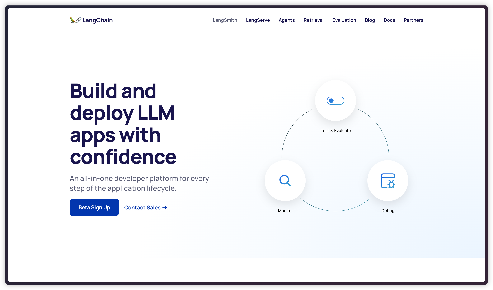
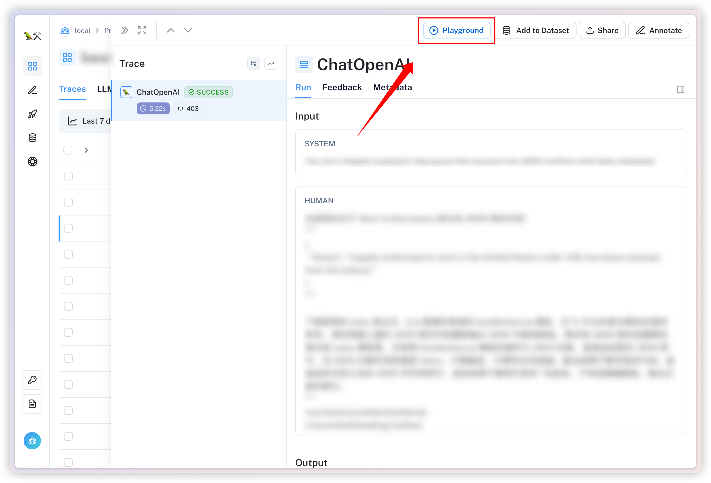
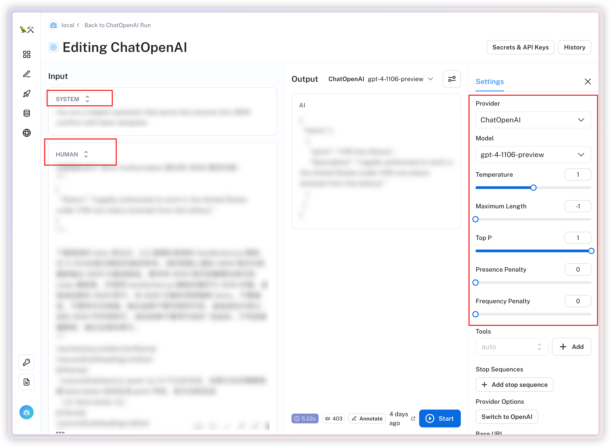
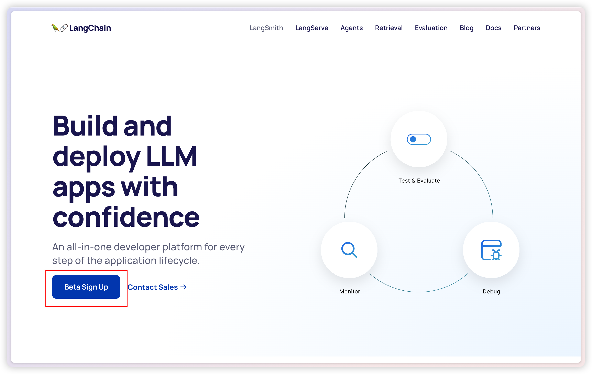
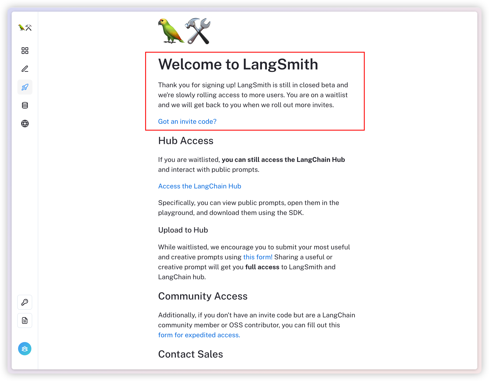
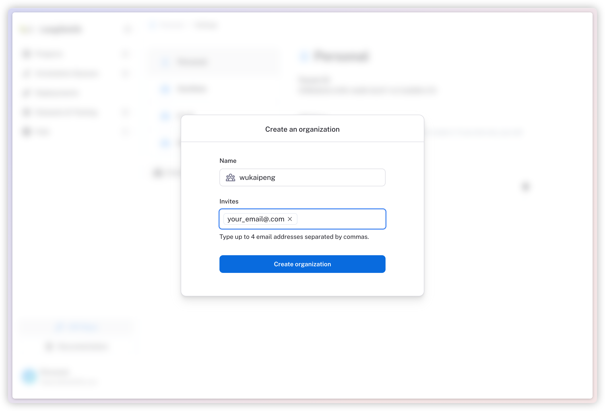
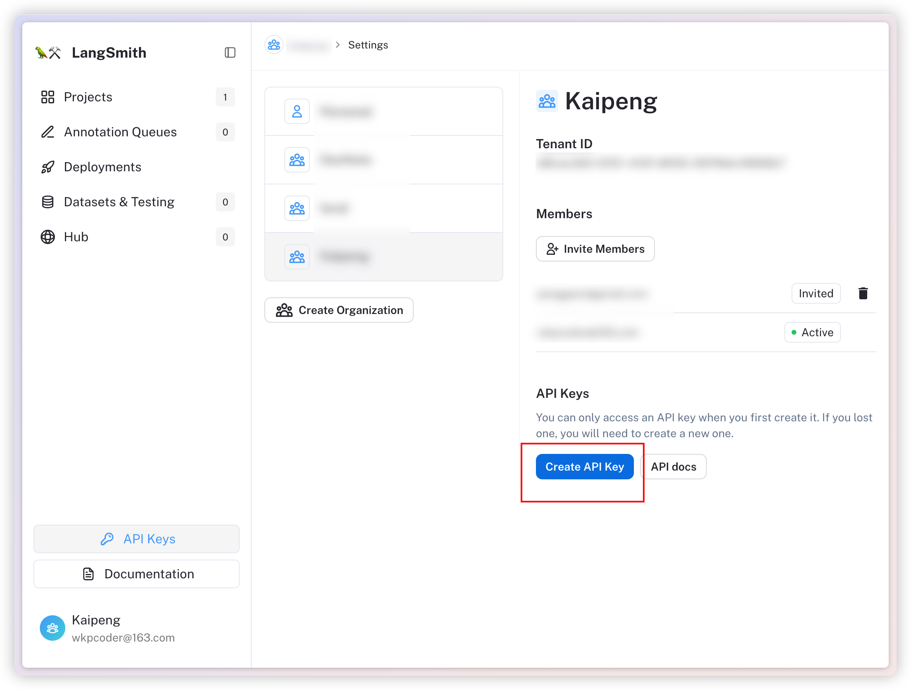
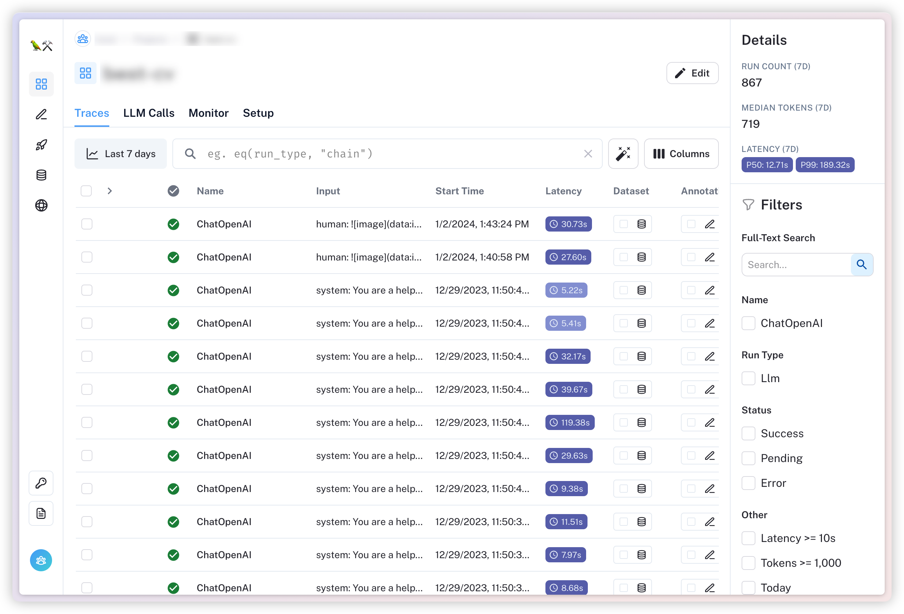

# 搭配 LangSmith 实现调试、监控、测试

[LangSmith](https://smith.langchain.com/) 是 LangChain 推出的 AI 应用调试、监控和测试平台。





LangSmith 会记录大模型发起的所有请求，除了输入输出，还能看到具体的所有细节，包括：
1. 请求的大模型、模型名、模型参数
2. 请求的时间、消耗的 token 数量
3. 请求中的所有上下文消息，包括系统消息


比较亮眼的功能是，LangSmith 可以把某条请求添加进 Playground，然后直接调试修改，重放该请求：

选中某条请求，点击「Playground」：


 


进入 Playground 后，这条请求会包括原本的所有消息上下文、使用的模型、参数等等，我们就可以直接修改对应的提示词，点击「Start」去重放测试：


  


有这个重放功能，对于某些测试 case，就不需要费心先为这个 case 构建请求环境模拟，再调试提示词，直接在 Playground 就能直接调试提示词，相当方便了。

LangSmith 的集成挺简单的，只需要一个 API 和 URL 即可，我们直接进入官网：[https://smith.langchain.com/](https://smith.langchain.com)


  


点击「Sign Up」，选择账号登录：


  


LangSmith 目前还处于 **Beta** 阶段，可以免费使用，但是会有白名单使用机制，如下就是 LangSmith 审核你的名单，还不能使用：


  


静候 LangSmith 的审核，或者去 LangSmith 的仓库里请求一个邀请码：
[Request for Invitation Code - LangSmith](https://github.com/langchain-ai/langsmith-sdk/issues/246)


> 试过让已经进入 LangSmith 的朋友邀请进组织，不过不行
>   


进入之后创建一个 API key：


  


然后在项目下设置这几个环境变量：

```bash
LANGCHAIN_TRACING_V2="true"
# 请求的 URL
LANGCHAIN_ENDPOINT="https://api.smith.langchain.com"
# API key
LANGCHAIN_API_KEY="YOUR_API_KEY"
# 项目名称
LANGCHAIN_PROJECT="YOUR_PROJECT_NAME"
```

其中 `LANGCHAIN_PROJECT` 可以不用设置，它会默认记录到一个叫做 `default` 的项目下。

设置之后，调用 LangChain 的方法：[
LangChain.js 实战系列：入门介绍](https://blog.csdn.net/YopenLang/article/details/135307578)

发送的请求就都会记录到 LangSmith 上了：


  


其他的一些创建组织、创建项目等的常见功能可以自行体验，总的来说，LangSmith 目前对于开发调试一个 AI 应用来说很方便，不过这个项目属于闭源，并且会记录 API Key 一些敏感信息，因此是否使用 LangSmith 具体看自己的项目情况。