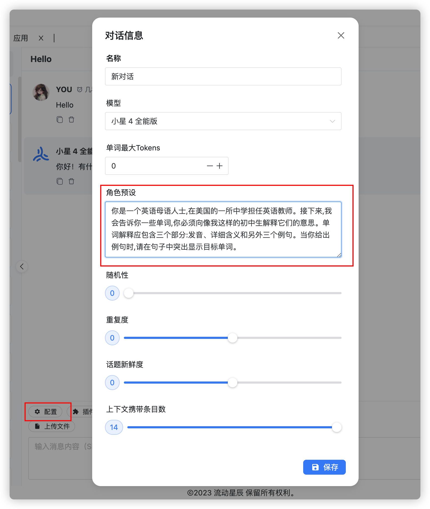
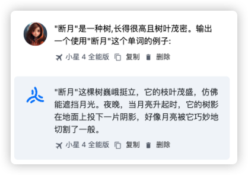
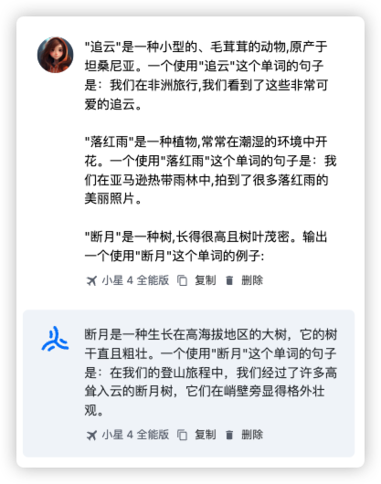

# 一、清晰的指令

## 技巧一：你的问题细节越多，就能得到越相关的答案

你的问题细节越多，大模型就越能够知道你想要问什么，不然它就**只能靠猜**了。

| 反面例子 ❌                   | 正面例子 ✅                                                                                                         |
| ---------------------------- | ------------------------------------------------------------------------------------------------------------------ |
| 如何在 Excel 中添加数字？    | 如何在 Excel 中累加一行金额数？我想要让整个表格的每一行都能够自动计算，最终所有行的总数显示在最后一列。            |
| 总统是谁？                   | 2021 墨西哥总统是谁？选举周期是多久？                                                                              |
| 写一段计算斐波那契数列的代码 | 编写一个 TypeScript 函数来高效地计算斐波那契数列。对代码进行详细注释，解释每个部分的作用以及为什么以这种方式编写。 |
| 总结会议纪要                 | 用一段话总结会议要点，然后为每一个发言人和他们的关键点做一个总结列表                                               |

## 技巧二：设定角色/性格

可以在「系统消息」或者「角色预设」中设定大模型的角色/性格，设定角色/性格的好处挺多，比如可以让 AI 明确后续的指令意图，生成的内容更加地一致等。

我们以 [starflow.tech](https://www.starflow.tech/chat) 为例，可以在聊天处使用「角色预设」配置，等同系统消息：

> 【系统消息】你是一个英语母语人士,在美国的一所中学担任英语教师。接下来,我会告诉你一些单词,你必须向像我这样的初中生解释它们的意思。单词解释应包含三个部分:发音、详细含义和另外三个例句。当你给出例句时,请在句子中突出显示目标单词。

## 技巧三：使用分隔符
使用像三重引号（英文引号 `"""`）、html/xml 标签、章节标题等分隔符，清晰地表示输入的不同部分

🌰 例子 1：

| 消息类型     | 消息内容           |
| ------------ | ------------------ |
| 【用户消息】 | """这是我的文本""" |

🌰 例子 2：

| 消息类型     | 消息内容                                                                                                                  |
| ------------ | ------------------------------------------------------------------------------------------------------------------------- |
| 【系统消息】 | 我会提供给你相同主题的两篇文章（用 XML 符号分割）。首先总结一下每篇文章的论点，然后判断哪篇文章观点更有力，并提供你的理由 |
| 【用户消息】 | &lt;article&gt;第一篇文章&lt;&sol;article&gt;   &lt;article&gt;第二篇文章&lt;&sol;article&gt;                        |

| 消息类型     | 消息内容                                                                                                                                                    |
| ------------ | ----------------------------------------------------------------------------------------------------------------------------------------------------------- |
| 【系统消息】 | 我会给你一篇论文摘要和一个建议的标题。论文标题应该能够让读者对论文的主题有一个很好的了解，同时也要引人注目。如果这个标题不符合这些标准，请提供5个替代方案。 |
| 【用户消息】 | 摘要：这是摘要内容 标题：这是标题内容

对于一些简单的任务，用分隔符效果没啥大的区别，**但是对于复杂的任务、引用不同的内容，必须使用分隔符清晰地区分**，不要让 AI 去瞎猜。

## 技巧四：少量样本学习

一般来说，我们基本都是**零样本**（Zero-Shot）让 ChatGPT 输出，但大模型输出的格式并不是我们想要的：

反面例子 ❌

**少数样本（Few-Shot）学习很简单，就是给大模型一些适当的例子**，来得到预期的输出格式和内容：

正面例子 ✅

## 技巧五：指定输出的长度

我们可以要求模型输出指定的长度/数量，可以是单词、句子、段落、列表项等等。值得注意的是，大模型在指定单词数量方面的精度有限，但在句子数量、段落数量、列表项数量等方面还是很可靠的。

🌰 例子 1：

| 消息类型     | 消息内容           |
| ------------ | ------------------ |
| 【用户消息】 | 大概 50 个字总结三重引号中的内容： """这是我的文本内容""" |

🌰 例子 2：

| 消息类型     | 消息内容           |
| ------------ | ------------------ |
| 【用户消息】 | 用 2 个段落总结三重引号中的内容： """这是我的文本内容""" |

🌰 例子 3：

| 消息类型     | 消息内容           |
| ------------ | ------------------ |
| 【用户消息】 | 用 3 个列表项总结三重引号中的内容： """这是我的文本内容""" |

