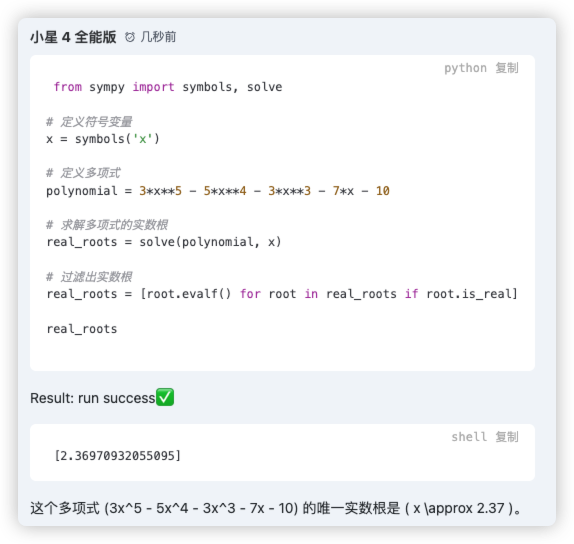

# 五、使用外部工具

## 技巧一：使用 embedding 去实现高效知识检索

在第二节[引用内容](https://doc.starflow.tech/docs/openai/02)中我们提到，把外部资源信息作为输入的一部分，可以让大模型产生可靠和最新的回答。例如，如果用户提出关于一部特定电影的问题，将高质量的有关该电影的信息（如演员、导演等）添加到模型的输入中会很有用。 Embedding（嵌入）是一种技术方法，它基于向量，可以找到两个文本之间的相似性。后续我们会专门开一篇文章来详细讲解这种方案。

## 技巧二：调用 API 或者代码执行

对于数学计算，大模型的表现很糟糕，但我们可以把这一步交给外部 API 或者代码执行，来得到准确可靠的结果。目前 GPT-4 已经集成了代码执行（Code Interpreter），可以下发指令让 GPT-4 执行代码，例如：

【用户消息】
```
调用代码执行器，找出以下多项式的所有实数根:3x**5-5x4-3*x3-7x-10
```

【GPT-4 回复】



## 技巧三：函数调用

函数调用（Function calling）可以看做是一种特殊的协议，它让 GPT-4 可以调用外部函数。